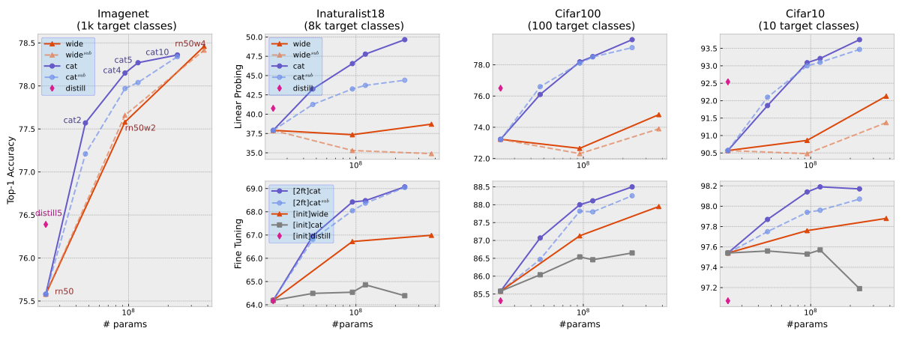

## Rich Representation Learning
### Official code for [learning useful representations for shifting tasks and distributions](https://arxiv.org/abs/2212.07346)


## requirements
portalocker
pyyaml


## datasets
For supervised transfer learning and self-supervised transfer learning, [ImageNet](https://www.image-net.org/download.php), [Inaturalist18](https://ml-inat-competition-datasets.s3.amazonaws.com/2018/train_val2018.tar.gz), Cifar10 and Cifar100 are tested. 

#### ImageNet:
Download [ImageNet](https://www.image-net.org/download.php), extract and move it under `data/` folder with name `data/imagenet`.

#### Inaturalist18
Download [Inaturalist18](https://ml-inat-competition-datasets.s3.amazonaws.com/2018/train_val2018.tar.gz) dataset, extract then move it under `data/` folder with name `data/inaturalist18`

For few-shot learning / meta-learning, CUB and miniImagenet are tested. 

For out-of-distribution robustness, Camlyon17 are testd. 


## Supervised transfer
### ImageNet1k supervise pretraining
Pretrain resnet50 10 times on ImageNet1k with different random seeds as [script](scripts/supervised_transfer/supervised_pretrain/resnet50.sh). Alternatively, we provide 10 such checkpoints at [here](https://drive.google.com/file/d/1puDJCfUdexV7jc2QDtzT3GIV6bK_a5DS/view?usp=sharing).

| architecture| N repeats | url    | args |
| :---:       |    :----: | :---:  | :---:|
| resnet50    | 10      | [model](https://drive.google.com/file/d/1puDJCfUdexV7jc2QDtzT3GIV6bK_a5DS/view?usp=sharing)  | [script](scripts/supervised_transfer/supervised_pretrain/resnet50.sh)|
| resnet50w2  | 1       | [model](https://drive.google.com/file/d/1yxpGox1on8EG-bgh5m96P-HmFdF1FqKV/view?usp=sharing)  | [script](scripts/supervised_transfer/supervised_pretrain/resnet50_wide.sh)|
| resnet50w4  | 1       | [model](https://drive.google.com/file/d/1BMCdWbRp4nUxRQwKux-_BEQS_5TKC2h6/view?usp=sharing)  | [script](scripts/supervised_transfer/supervised_pretrain/resnet50_wide.sh)|	
| 2resnet50   | 1       | [model](https://drive.google.com/file/d/1vC5es1ysSSZOEhkKQWBafjRyLR_oFPgl/view?usp=sharing)  | [script](scripts/supervised_transfer/supervised_pretrain/resnet50_wide.sh)|
| 4resnet50   | 1       | [model](https://drive.google.com/file/d/1J3adr3hepZZXyLcncduBi3v6PZLPAEW5/view?usp=sharing)  | [script](scripts/supervised_transfer/supervised_pretrain/resnet50_wide.sh)|

```
📦 RRL
 ┣ 📂checkpoints
 ┃ ┣ 📂supervised_pretrain
 ┃ ┃ ┣ 📂resnet50
 ┃ ┃ ┃ ┣📜 ]
 ┃ ┃ ┃ ┃ ...			
 ┃ ┃ ┃ ┗📜 checkpoint_run9.pth.tar 
 ┃ ┃ ┣📜 2resnet50_imagenet1k_supervised.pth.tar
 ┃ ┃ ┣📜 4resnet50_imagenet1k_supervised.pth.tar
 ┃ ┃ ┣📜 resnet50w2_imagenet1k_supervised.pth.tar
 ┃ ┃ ┗📜 resnet50w4_imagenet1k_supervised.pth.tar
 ┃ ┣ 📂self_supervised_pretrain
 ┃ ┃ ┣📜 swav_400ep_pretrain.pth.tar
 ┃ ┃ ┣📜 swav_RN50w2_400ep_pretrain.pth.tar
 ┃ ┃ ┣📜 swav_RN50w4_400ep_pretrain.pth.tar
 ┃ ┃ ┣📜 swav_RN50w5_400ep_pretrain.pth.tar
 ┃ ┃ ┣📜 swav_400ep_pretrain_seed5.pth.tar
 ┃ ┃ ┣📜 swav_400ep_pretrain_seed6.pth.tar
 ┃ ┃ ┣📜 swav_400ep_pretrain_seed7.pth.tar
 ┃ ┃ ┣📜 swav_400ep_pretrain_seed8.pth.tar
 ┃ ┃ ┣📜 swav_400ep_pretrain_seed8.pth.tar
 ┃ ┃ ┣📜 seer_regnet32gf.pth
 ┃ ┃ ┣📜 seer_regnet64gf.pth
 ┃ ┃ ┣📜 seer_regnet128gf.pth
 ┃ ┃ ┣📜 seer_regnet256gf.pth
 ┃ ┃ ┣📜 seer_regnet32gf_finetuned.pth
 ┃ ┃ ┣📜 seer_regnet64gf_finetuned.pth
 ┃ ┃ ┣📜 seer_regnet128gf_finetuned.pth
 ┃ ┃ ┣📜 seer_regnet256gf_finetuned.pth
```
### transfer
#### Linear Probing

|method|architecture| target task |args|
|:---:       |:---:        |:---:       |
|ERM|  resnet50  | Cifar10/Cifar100|[scripts](scripts/supervised_transfer/imagenet/to_cifar/linear_probing/cifar_bn.sh)|
|ERM|  resnet50w2/w4 2x/4xresnet50 | Cifar10/Cifar100|[scripts](scripts/supervised_transfer/imagenet/to_cifar/linear_probing/cifar_bn_wide.sh)|
|CAT| resnet50 | Cifar10/Cifar100|[scripts](scripts/supervised_transfer/imagenet/to_cifar/linear_probing/cat_cifar_bn.sh)|
|Distill| resnet50| Cifar10/Cifar100| |
|ERM|  resnet50  | Inaturalist18|[scripts](scripts/supervised_transfer/imagenet/to_cifar/linear_probing/cifar_bn.sh)|
|ERM|  resnet50w2/w4 2x/4xresnet50 | Inaturalist18|[scripts](scripts/supervised_transfer/imagenet/to_cifar/linear_probing/cifar_bn_wide.sh)|
|CAT| resnet50 | Inaturalist18|[scripts](scripts/supervised_transfer/imagenet/to_cifar/linear_probing/cat_cifar_bn.sh)|
|Distill| resnet50| Inaturalist18| |




|method  |   architecture  |   params  |   CIFAR10  |   CIFAR100  |   INAT18  |   CIFAR10  |   CIFAR100  |   INAT18|
|--------|--------|:--------:|:--------:|:--------:|:--------:|:--------:|:--------:|:--------:|
|ERM  |   RESNET50  |   23.5M  |   97.54  |   85.58  |   64.19  |   -  |   -  |   -|
|ERM  |   RESNET50W2  |   93.9M  |   97.76  |   87.13  |   66.72  |   -  |   -  |   -|
|ERM  |   RESNET50W4  |   375M  |   97.88  |   87.95  |   66.99  |   -  |   -  |   -|
|ERM  |   2×RESNET50  |   47M  |   97.39  |   85.77  |   62.57  |   -  |   -  |   -|
|ERM  |   4×RESNET50  |   94M  |   97.38  |   85.56  |   61.58  |   -  |   -  |   -|
|CAT2  |   2×RESNET50  |   47M  |   97.56  |   86.04  |   64.49  |   97.87  |   87.07  |   66.96|
|CAT4  |   4×RESNET50  |   94M  |   97.53  |   86.54  |   64.54  |   98.14  |   88.00  |   68.42|
|CAT5  |   5×RESNET50  |   118M  |   97.57  |   86.46  |   64.86  |   98.19  |   88.11  |   68.48|
|CAT10  |   10×RESNET50  |   235M  |   97.19  |   86.65  |   64.39  |   98.17  |   88.50  |   69.07|
|DISTILL5  |   RESNET50  |   23.5M  |   97.07  |   85.31  |   64.17  |   -  |   -  |   -|

### Download vision transformer checkpoints
### transfer 


## self-supervised transfer

### SWAV
#### Download [SWAV](https://github.com/facebookresearch/swav) Imagenet1k pretrained checkpoints:
```
mkdir checkpoints/swav -p
wget https://dl.fbaipublicfiles.com/deepcluster/swav_400ep_pretrain.pth.tar -O checkpoints/self_supervised_pretrain/swav_400ep_pretrain.pth.tar
wget https://dl.fbaipublicfiles.com/deepcluster/swav_RN50w2_400ep_pretrain.pth.tar -O  checkpoints/self_supervised_pretrain/swav_RN50w2_400ep_pretrain.pth.tar
wget https://dl.fbaipublicfiles.com/deepcluster/swav_RN50w4_400ep_pretrain.pth.tar -O  checkpoints/self_supervised_pretrain/swav_RN50w4_400ep_pretrain.pth.tar
wget https://dl.fbaipublicfiles.com/deepcluster/swav_RN50w5_400ep_pretrain.pth.tar -O  checkpoints/self_supervised_pretrain/swav_RN50w5_400ep_pretrain.pth.tar
```

#### Pretrain SWAV mutiple times with different seeds
To have mutiple SWAV checkpoints with only different seeds, we need to pretrain SWAV mutiple times with different seeds.
Here we pretrain SWAV ResNet50 on ImageNet1k with different seeds using [code](https://github.com/facebookresearch/swav/blob/main/scripts/swav_400ep_pretrain.sh). (NOTE: customize the ```--seed``` option.)

[TODO can we public our pretrained checkpoints?](https://drive.google.com/file/d/1D2DCInQKpqgqQC3dxtf5eOLD-dSrm2yN/view?usp=sharing)


### SEER (Instagram-1B)
Pretrained and ImageNet finetuned checkpoints comes from [here](https://github.com/facebookresearch/vissl/tree/main/projects/SEER)
#### Download checkpoints

Download [SEER](https://github.com/facebookresearch/vissl/tree/main/projects/SEER) Instagram-1B pretrained checkpoints:
```
mkdir checkpoints/seer -p
wget https://dl.fbaipublicfiles.com/vissl/model_zoo/seer_regnet32d/seer_regnet32gf_model_iteration244000.torch -O checkpoints/self_supervised_pretrain/seer_regnet32gf.pth
wget https://dl.fbaipublicfiles.com/vissl/model_zoo/seer_regnet64/seer_regnet64gf_model_final_checkpoint_phase0.torch -O checkpoints/self_supervised_pretrain/seer_regnet64gf.pth
wget https://dl.fbaipublicfiles.com/vissl/model_zoo/swav_ig1b_regnet128Gf_cnstant_bs32_node16_sinkhorn10_proto16k_syncBN64_warmup8k/model_final_checkpoint_phase0.torch -O checkpoints/self_supervised_pretrain/seer_regnet128gf.pth
wget https://dl.fbaipublicfiles.com/vissl/model_zoo/swav_ig1b_cosine_rg256gf_noBNhead_wd1e5_fairstore_bs16_node64_sinkhorn10_proto16k_apex_syncBN64_warmup8k/model_final_checkpoint_phase0.torch -O checkpoints/self_supervised_pretrain/seer_regnet256gf.pth
```


Download ImageNet1k finetuned [SEER](https://github.com/facebookresearch/vissl/tree/main/projects/SEER) checkpoints:
```
wget https://dl.fbaipublicfiles.com/vissl/model_zoo/seer_finetuned/seer_regnet32_finetuned_in1k_model_final_checkpoint_phase78.torch -O checkpoints/self_supervised_pretrain/seer_regnet32gf_finetuned.pth
https://dl.fbaipublicfiles.com/vissl/model_zoo/seer_finetuned/seer_regnet64_finetuned_in1k_model_final_checkpoint_phase78.torch -O checkpoints/self_supervised_pretrain/seer_regnet64gf_finetuned.pth
https://dl.fbaipublicfiles.com/vissl/model_zoo/seer_finetuned/seer_regnet128_finetuned_in1k_model_final_checkpoint_phase78.torch -O checkpoints/self_supervised_pretrain/seer_regnet128gf_finetuned.pth
https://dl.fbaipublicfiles.com/vissl/model_zoo/seer_finetuned/seer_regnet256_finetuned_in1k_model_final_checkpoint_phase38.torch -O checkpoints/self_supervised_pretrain/seer_regnet256gf_finetuned.pth
```


### transfer


## few-shot learning and meta-learning

## OOD

